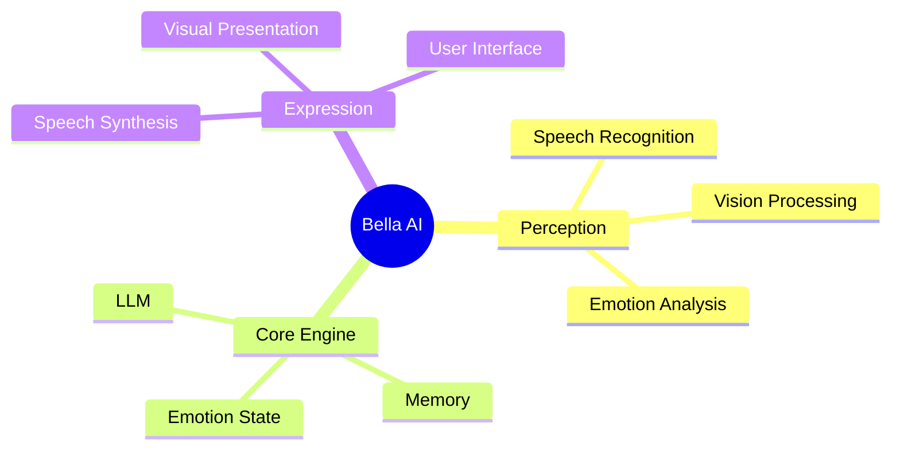

<div align="center">


# Bella AI

A digital companion platform combining voice interaction, conversational AI, visual expression, and emotional awareness.

[](LICENSE)
[](https://nodejs.org/)
[]()

</div>

---

## Overview

Bella AI is an experimental digital companion platform designed to explore natural human-AI interaction through voice, conversation, emotional awareness, and adaptive behavior.

The project combines speech recognition, language models, text-to-speech, visual presentation systems, and future memory capabilities into a unified architecture focused on long-term companionship and personalized interaction.

---

## Features

### Voice Interaction

* Speech recognition using Whisper ASR
* Real-time voice input processing
* Voice command handling
* Browser microphone integration

### Visual Presentation

* Dynamic video presentation system
* Smooth visual transitions
* Responsive user interface
* Animated interaction states

### AI Foundation

* Modular AI architecture
* Local model support
* LLM integration framework
* Event-driven design

### User Experience

* Responsive interface
* Loading and interaction states
* Emotional feedback system
* Relationship and affinity tracking

### Model Management

* Automated model downloads
* Local model deployment
* Provider abstraction layer
* Extensible AI backend support

---

## Current Development Status

### Available

* Whisper-based speech recognition
* Interactive user interface
* Visual presentation system
* Core AI architecture
* Local web server
* Model management tools
* Basic emotional interaction system

### In Development

* LLM reasoning engine
* Text-to-speech integration
* Emotion state management
* Multi-model orchestration

### Planned

* Long-term memory system
* Short-term memory system
* Facial expression recognition
* Personalized behavior modeling
* Proactive interaction system
* Continuous learning capabilities

---

## Quick Start

### Requirements

* Node.js 22.16.0 or later
* Modern browser
* Microphone access

### Installation

Clone the repository:

```bash
git clone <repository-url>

cd Bella
```

Install dependencies:

```bash
npm install
```

Download AI models:

```bash
npm run download
```

Start the application:

```bash
npm start
```

Open:

```text
http://localhost:8081
```

---

## Architecture

### Design Principles

* AI-first architecture
* Modular component design
* Event-driven communication
* Local-first AI processing
* Extensible model integrations

### System Overview



---

## Technology Stack

| Layer              | Technology                  |
| ------------------ | --------------------------- |
| Frontend           | JavaScript, HTML5, CSS3     |
| Backend            | Node.js, Express            |
| Speech Recognition | Whisper ASR                 |
| Language Models    | Local LLM Integration       |
| Speech Synthesis   | TTS                         |
| Architecture       | Event-Driven Modular Design |

---

## Project Structure

```text
Bella/
├── index.html
├── style.css
├── main.js
├── core.js
├── script.js
├── download_models.js
├── package.json
├── models/
├── providers/
├── assets/
├── docs/
└── server/
```

---

## Development

Install dependencies:

```bash
npm install
```

Download models:

```bash
npm run download
```

Start development server:

```bash
npm start
```

---

## Roadmap

### Phase 1 — Perception Layer

* Speech recognition
* Visual presentation
* User interaction framework
* TTS integration

### Phase 2 — Cognitive Layer

* Reasoning engine
* Emotion state system
* Memory management
* Personalized responses

### Phase 3 — Companion Layer

* Proactive interactions
* Behavioral adaptation
* Long-term memory
* Continuous learning

---

## Documentation

| Document             | Description                    |
| -------------------- | ------------------------------ |
| PRD.md               | Product requirements           |
| LOCAL_MODEL_GUIDE.md | Local model setup              |
| NPM_GUIDE.md         | Dependency management          |
| Feature List         | Planned and completed features |
| Development Plan     | Project roadmap                |

---

## Vision

Bella AI is an exploration of long-term human-AI interaction.

The project focuses on building systems that can listen, remember, communicate, and evolve through ongoing interaction while maintaining a modular and extensible architecture for future research and development.

---

## License

MIT License

See the LICENSE file for details.
